# 01 Creating a Qt Widget Based Application

This tutorial describes how to use Qt Creator to create a small Qt application, Text Finder. It is a simplified version of the Qt UI Tools [Text Finder](https://doc.qt.io/qt/qtuitools-textfinder-example.html) example. You'll use Qt Designer to construct the application user interface from Qt widgets and the code editor to write the application logic in C++.

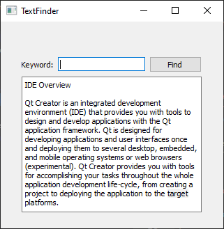

## 1.1 Creating the Text Finder Project

1. Select **File** > **New Project** > **Application (Qt)** > **Qt Widgets Application** > **Choose**.
    
    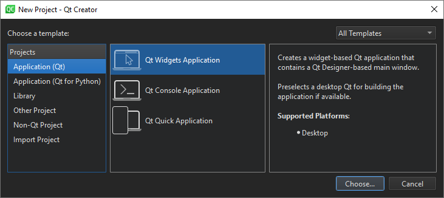
    
    The **Project Location** dialog opens.
    
    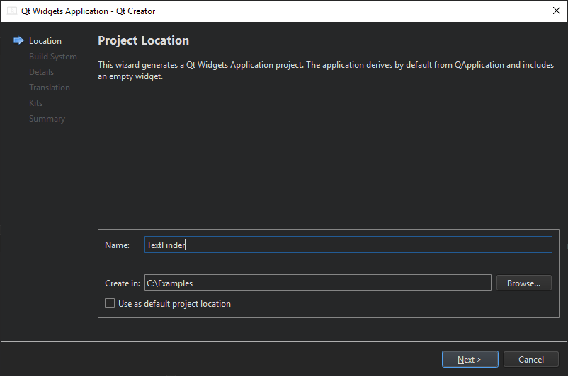
    
2. In the **Name** field, type **TextFinder**.
3. In the **Create in** field, enter the path for the project files. For example, `C:\Qt\examples`.
4. Select **Next** (on Windows and Linux) or **Continue** (on macOS) to open the **Define Build System** dialog.
    
    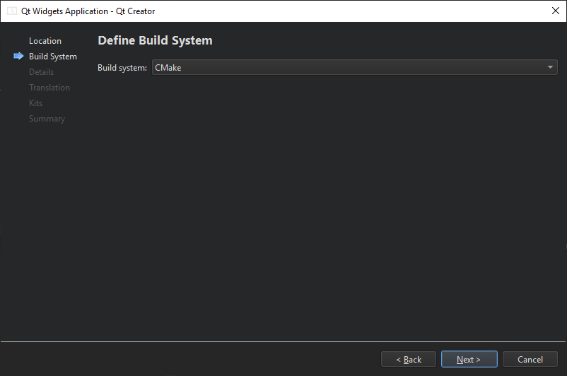
    
5. In the **Build system** field, select [CMake](https://doc.qt.io/qtcreator/creator-project-cmake.html) as the build system to use for building the project.
6. Select **Next** or **Continue** to open the **Class Information** dialog.
    
    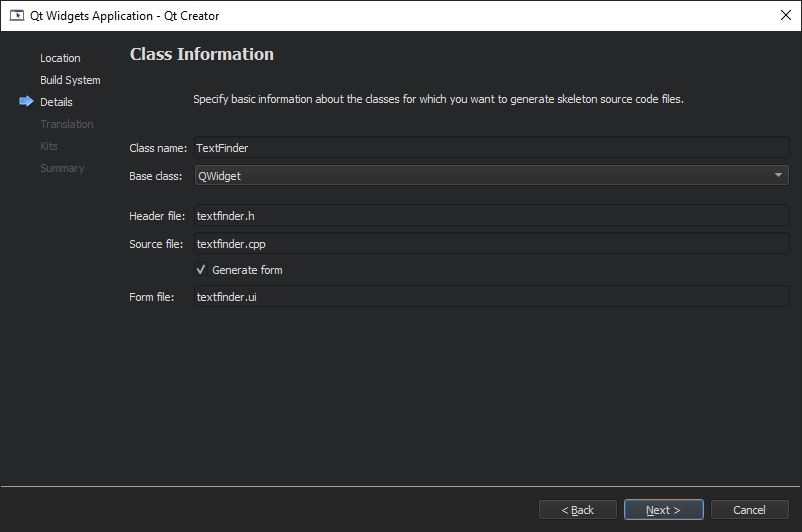
    
7. In the **Class name** field, type **TextFinder** as the class name.
8. In the **Base class** list, select **[QWidget](https://doc.qt.io/qt/qwidget.html)** as the base class type.    

> [!Note] 
> The **Header file**, **Source file** and **Form file** fields are automatically updated to match the name of the class.
> 

9. Select **Next** or **Continue** to open the **Translation File** dialog.
    
    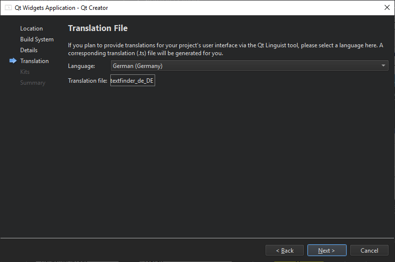
    
10. In the **Language** field, you can select a language that you plan to [translate](https://doc.qt.io/qtcreator/creator-how-to-use-qtlinguist.html) the application to. This sets up localization support for the application. You can add other languages later by editing the project file.
11. Select **Next** or **Continue** to open the **Kit Selection** dialog.
    
    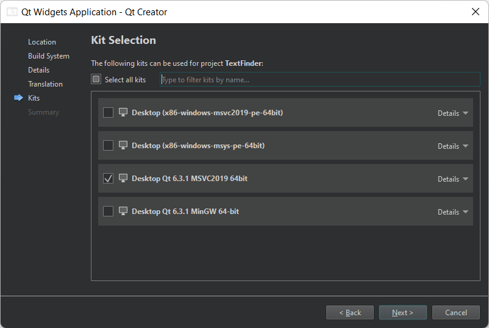
    
12. Select build and run [kits](https://doc.qt.io/qtcreator/creator-glossary.html#glossary-buildandrun-kit) for your project.
13. Select **Next** or **Continue** to open the **Project Management** dialog.
    
    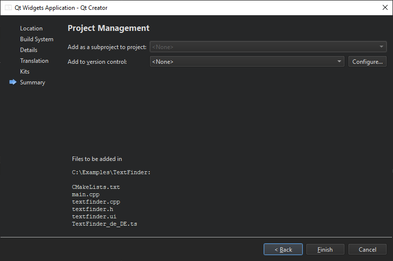
    
14. Review the project settings, and select **Finish** (on Windows and Linux) or **Done** (on macOS) to create the project.

> [!Note]
> The project opens in the **Edit** mode, which hides these instructions. To return to these instructions, open the **Help** mode.

The TextFinder project now has the following files:

- main.cpp
- textfinder.h
- textfinder.cpp
- textfinder.ui
- CMakeLists.txt

The `.h` and `.cpp` files come with the necessary boiler plate code.

If you selected CMake as the build system, Qt Creator created a `CMakeLists.txt` project file for you.

## 1.2 Filling in the Missing Pieces

Begin by designing the user interface and then move on to filling in the missing code. Finally, add the find functionality.

### 1.2.1 Designing the User Interface

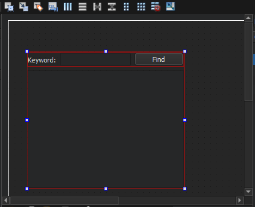

1. In the **Editor** mode, double-click the textfinder.ui file in the **Projects** view to launch the integrated Qt Designer.
2. Drag the following widgets to the form:
    - **Label** ([QLabel](https://doc.qt.io/qt/qlabel.html))
    - **Line Edit** ([QLineEdit](https://doc.qt.io/qt/qlineedit.html))
    - **Push Button** ([QPushButton](https://doc.qt.io/qt/qpushbutton.html))
3. Double-click the **Label** widget and enter the text **Keyword**.
4. Double-click the **Push Button** widget and enter the text **Find**.
5. In the **Properties** view, change the **objectName** to **findButton**.
	
	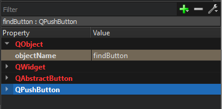
6. Press **Ctrl+A** (or **Cmd+A**) to select the widgets and select **Lay out Horizontally** (or press **Ctrl+H** on Linux or Windows or **Ctrl+Shift+H** on macOS) to apply a horizontal layout ([QHBoxLayout](https://doc.qt.io/qt/qhboxlayout.html)).
7. Drag a **Text Edit** widget ([QTextEdit](https://doc.qt.io/qt/qtextedit.html)) to the form.
8. Select the screen area, and then select **Lay out Vertically** (or press **Ctrl+L**) to apply a vertical layout ([QVBoxLayout](https://doc.qt.io/qt/qvboxlayout.html)).
9. To call a find function when users select the **Find** button, you use the Qt signals and slots mechanism. A signal is emitted when a particular event occurs and a slot is a function that is called in response to a particular signal. Qt widgets have predefined signals and slots that you can use directly from Qt Designer. To add a slot for the find function:
    - Right-click the **Find** button to open a context-menu.
    - Select **Go to Slot** > **clicked()**, and then select **OK**.
        
        This adds a private slot, `on_findButton_clicked()`, to the header file, textfinder.h and a private function, `TextFinder::on_findButton_clicked()`, to the source file, textfinder.cpp.
        
10. Press **Ctrl+S** (or **Cmd+S**) to save your changes.

### 1.2.2 Completing the Header File

The textfinder.h file already has the necessary`#includes` , a constructor, a destructor, and the `Ui` object. You need to add a private function, `loadTextFile()`, to read and display the contents of the input text file in the [QTextEdit](https://doc.qt.io/qt/qtextedit.html).

1. In the **Projects** view in the **Edit view**, double-click the `textfinder.h` file to open it for editing.
2. Add a private function to the `private` section, after the `Ui::TextFinder` pointer : 
	
```C++
private slots:
	void on_findButton_clicked();

private:
	Ui::TextFinder *ui;
	void loadTextFile();
```

### 1.2.3 Completing the Source File

Now that the header file is complete, move on to the source file, textfinder.cpp.

1. In the **Projects** view in the **Edit** view, double-click the textfinder.cpp file to open it for editing.
2. Add code to load a text file using [QFile](https://doc.qt.io/qt/qfile.html), read it with [QTextStream](https://doc.qt.io/qt/qtextstream.html), and then display it on `textEdit` with [QTextEdit::setPlainText](https://doc.qt.io/qt/qtextedit.html#setPlainText)():

```C++
#include <QFile>
#include <QTextStream

void TextFinder::loadTextFile ()
{
	QFile inputFile (":/input.txt");
	inputFile.open (QIODevice::ReadOnly);

    QTextStream in (&inputFile);
    QString line = in.readAll();
    inputFile.close ();

    ui->textEdit->setPlainText(line);
    QTextCursor cursor = ui->textEdit->textCursor();
    cursor.movePosition(QTextCursor::Start, QTextCursor::MoveAnchor, 1);
}
```

3. For the `on_findButton_clicked()` slot, add code to extract the search string and use the [QTextEdit::find](https://doc.qt.io/qt/qtextedit.html#find)() function to look for the search string within the text file :

```C++
void TextFinder::on_findButton_clicked()
{
	QString searchString = ui->lineEdit->text();
    ui->textEdit->find(searchString, QTextDocument::FindWholeWords);
}
```

4. Add a line to call `loadTextFile()` in the constructor :

```C++
TextFinder::TextFinder(QWidget *parent)
    : QWidget(parent)
    , ui(new Ui::TextFinder)
{
    ui->setupUi(this);
    loadTextFile();
}
```

### 1.2.4 Creating a Resource File

You need a resource file (.qrc) within which you embed the input text file. The input file can be any .txt file with a paragraph of text. Create a text file called input.txt and store it in the textfinder folder.

To add a resource file:

1. Select **File** > **New File** > **Qt** > **Qt Resource File** > **Choose**.
	
	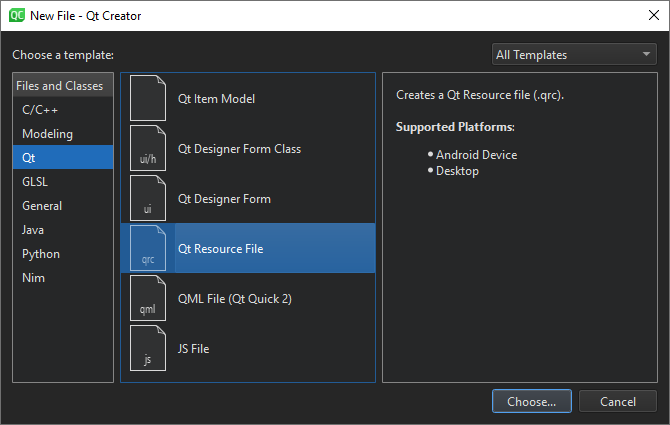
	
	The **Choose the Location** dialog opens.
	
	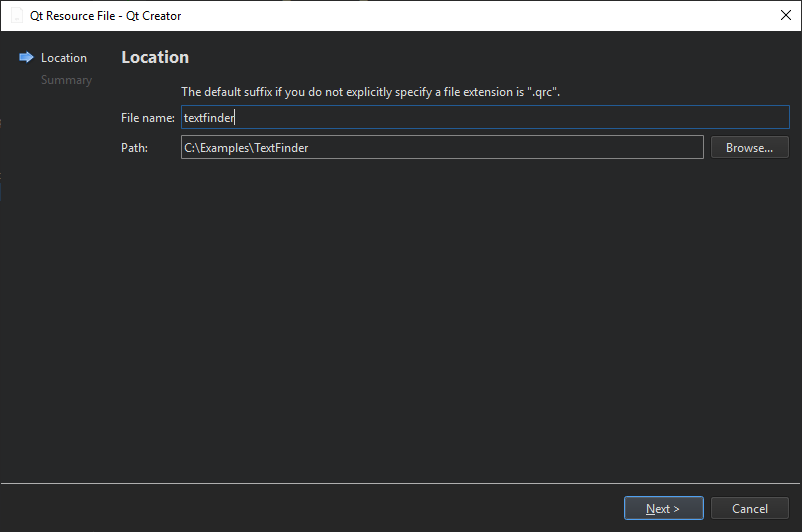

2. In the **Name** field, enter **textfinder**.
3. In the **Path** field, enter the path to the project, and select **Next** or **Continue**.
    
    The **Project Management** dialog opens.
4. In the **Add to project** field, select **TextFinder** and select **Finish** or **Done** to open the file in the code editor.
5. Select **Add** > **Add Prefix**.
6. In the **Prefix** field, replace the default prefix with a slash (/).
7. Select **Add** > **Add Files**, to locate and add input.txt.
	
	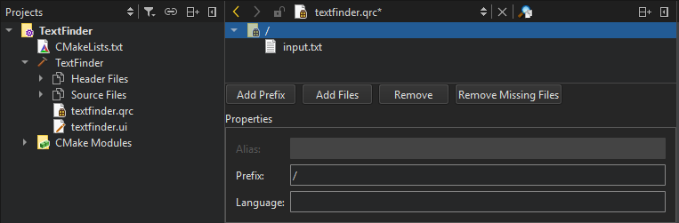

## 1.3 Adding Resources to Project File

For the text file to appear when you run the application, you must specify the resource file as a source file in the _CMakeLists.txt_ file that the wizard created for you:

```CMake
set(PROJECT_SOURCES
        main.cpp
        textfinder.cpp
        textfinder.h
        textfinder.ui
        ${TS_FILES}
        textfinder.qrc
)
```

## 1.4 Compiling and Running Your Application[](https://doc.qt.io/qtcreator/creator-writing-program.html#compiling-and-running-your-application "Direct link to this headline")

Now that you have all the necessary files, select the ![]( button to compile and run your application.