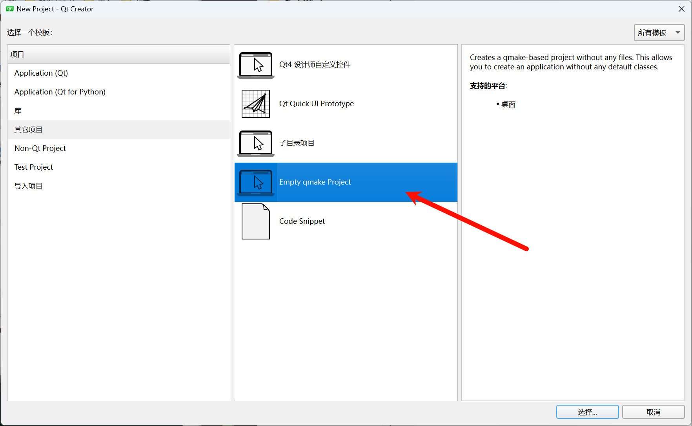

**Qt** (pronounced as "**cute**", not "cu-tee") is a **cross-platform framework** that is usually used as a **graphical toolkit**, although it is also very helpful in **creating CLI applications**. It runs on the three major desktop OSes, as well as on mobile OSes, such as Symbian, Nokia Belle, Meego Harmattan, MeeGo or BB10, and on embedded devices. Ports for Android (Necessitas) and iOS are also in development.

Qt has an impressive collection of modules, including

- **QtCore**, a base library that provides **containers, thread management, event management**, and much more
- **QtGui** and **QtWidgets**, a **GUI toolkit for Desktop**, that provides a lot of graphical components to design applications.
- **QtNetwork**, that provides a useful set of classes to deal with network communications
- **QtWebkit**, the webkit engine, that enable the use of web pages and web apps in a Qt application.
- **QtSQL**, a full featured SQL RDBM abstraction layer extensible with own drivers, support for ODBC, SQLITE, MySQL and PostgreSQL is available out of the box
- **QtXML**, support for simple XML parsing (SAX) and DOM
- **QtXmlPatterns**, support for XSLT, XPath, XQuery and Schema validation

# Our first window

Let's start by creating our first project. It will be an empty project, so we have to proceed with: File > New file or project > Other Projects > Empty Qt Project



This is the project file (extension `.pro`). Qt uses a **command line tool** that **parses these project files in order to generate "makefiles"**, files that are used by compilers to build an application. This tool is called **qmake**. But, we shouldn't bother too much about qmake, since Qt Creator will do the job for us.

In a project file, there is some minimal code that should always be written :

```.pro
TEMPLATE = app
TARGET = name_of_the_app

QT = core gui

greaterThan(QT_MAJOR_VERSION, 4): QT += widgets
```

- **_TEMPLATE_** describes the type to build. It can be an application, a library, or simply subdirectories.
- **_TARGET_** is the name of the app or the library.
- **_QT_** is used to indicate what libraries (Qt modules) are being used in this project. Since our first app is a small GUI, we will need QtCore and QtGui.

Let's now **add the entry point** of our application. Using File > New file or project > C++ > C++ Source file should do the job.

Follow the wizard once again, naming the file "main", and you are done. You will notice that **in the project file, a new line has been added automatically by Qt Creator** :

```.pro
TEMPLATE = app
TARGET = FirstWindow

QT = core gui

greaterThan(QT_MAJOR_VERSION, 6): QT += widgets

SOURCES += \
    main.cpp

```

Headers and sources files can be added manually with

```.pro
HEADERS += first_file.h second_file.h
SOURCES += first_file.cpp second_file.cpp
```

If you use Qt Creator's wizards, this is done automatically.

The minimal source code of a Qt application is

```C++
#include <QApplication>

int main(int argc, char **argv)
{
	QApplication app (argc, argv);
	return app.exec();
}
```

**QApplication** is a very important **class**. It **takes care of input arguments**, but also a lot of other things, and most notably, the _event loop_. The **event loop** is a loop that waits for user input in GUI applications.

When calling `app.exec ()` , the event loop is launched.

Let's compile this application. By clicking on the green arrow on the bottom left, Qt Creator will compile and execute it. And what happened? The application seems to be launched and not responding. That is actually normal. The event loop is running and waiting for events, like mouse clicks on a GUI, but we did not provide any event to be processed, so it will run indefinitely.

Let's add something to be displayed.

```C++
#include <QApplication>
#include <QPushButton>

int main(int argc, char **argv)
{
 QApplication app (argc, argv);

 QPushButton button ("Hello world !");
 button.show();

 return app.exec();
}
```

Compile it, and … here it is ! Our first window ! 