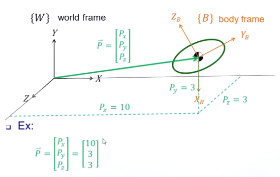

# 01 移动

对于一个刚体在世界坐标中的移动，我们可以使用一个 **位移向量 $\vec{p}$ 来描述 $\{B\}$ 的原点相对于 $\{W\}$ 的原点的位移** ：

$$\vec{p} = \begin{bmatrix}p_x \\ p_y \\ p_z \end{bmatrix}$$

向量可以表述两种空间关系：

- **A Position in Space** ：用于描述位置关系
- **A Vector** ：用于表示方向

# 02 转动

为了方便描述，我们将世界坐标记为 $\{A\}$ ，并通过 **旋转矩阵 (Rotation Matrix)** 来描述 $\{B\}$ 相对于 $\{A\}$ 的姿态。

我们首先将建立在刚体的坐标系 $\{B\}$ 的 **三个主轴在 $\{A\}$ 下形成的向量** 存储在一个矩阵中，如：

$$_B^AR = \begin{bmatrix}| && | && | \\ ^A\hat{X_B} && ^A\hat{Y_B} && ^A\hat{Z_B} \\ | && | && |\end{bmatrix}$$

其中，三个主轴形成的向量是在 $\{A\}$ 中观察的，所以有上标 $^A$ 。而对于每一个主轴形成的向量，他作为一个 **列向量 (Column Vector)** 存储在该矩阵中，因此， $_B^AR$ 是一个 **3x3** 的矩阵，实际上为：

$$_B^AR = \begin{bmatrix}X_x && Y_x && Z_x \\ X_y && Y_y && Z_y \\ X_z && Y_z && Z_z \end{bmatrix}$$

