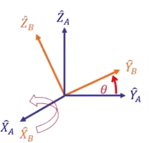

# 01 特性

## 1.1 转置

旋转矩阵中每一个列向量的三个分量都是 **body frame 主轴在 world frame 主轴上的分量** ， 也就是 $\hat{X_B}$ , $\hat{Y_B}$ , $\hat{Z_B}$ 与 $\hat{X_A}$ , $\hat{Y_A}$ , $\hat{Z_A}$ 三个向量的 **内积** ，即：

$$ _B^AR = \begin{bmatrix} | && | && | \\ ^A\hat{X_B} && ^A\hat{Y_B} && ^A\hat{Z_B} \\ | && | && | \end{bmatrix} =
\begin{bmatrix} \hat{X_B} \cdot \hat{X_A} && \hat{Y_B} \cdot \hat{X_A} && \hat{Z_B} \cdot \hat{X_A} \\  \hat{X_B} \cdot \hat{Y_A} && \hat{Y_B} \cdot \hat{Y_A} && \hat{Z_B} \cdot \hat{Y_A} \\  \hat{X_B} \cdot \hat{Z_A} && \hat{Y_B} \cdot \hat{Z_A} && \hat{Z_B} \cdot \hat{Z_A} \end{bmatrix}$$

而我们又知道，内积中向量的顺序对于计算结果并无影响，所以：

$$_B^AR = \begin{bmatrix} \hat{X_A} \cdot \hat{X_B} && \hat{X_A} \cdot \hat{Y_B} && \hat{X_A} \cdot \hat{Z_B} \\  \hat{Y_A} \cdot \hat{X_B} && \hat{Y_A} \cdot \hat{Y_B} && \hat{Y_A} \cdot \hat{Z_B} \\  \hat{Z_A} \cdot \hat{X_B} && \hat{Z_A} \cdot \hat{Y_B} && \hat{Z_A} \cdot \hat{Z_B} \end{bmatrix} = 
\begin{bmatrix} - && ^B\hat{X_A}^T && - \\ - && ^B\hat{Y_A}^T && - \\ - && ^B\hat{Z_A}^T && - \end{bmatrix} = \begin{bmatrix} | && | && | \\ ^B\hat{X_A} && ^B\hat{Y_A} && ^B\hat{Z_A} \\ | && | && | \end{bmatrix}^T =\ _A^BR^T $$

从上面可以看到，从 $\{A\}$ 对 $\{B\}$ 的旋转矩阵与 $\{B\}$ 对 $\{A\}$ 的旋转矩阵只相差一个 **转置** 。

## 1.2 正交

假如我们将旋转矩阵和其转置矩阵相乘，即：

$$\begin{array}{l}
_B^AR^T\ _B^AR &=& \begin{bmatrix} | && | && | \\ ^B\hat{X_A} && ^B\hat{Y_A} && ^B\hat{Z_A} \\ | && | && | \end{bmatrix}^T \begin{bmatrix} | && | && | \\ ^A\hat{X_B} && ^A\hat{Y_B} && ^A\hat{Z_B} \\ | && | && | \end{bmatrix} \\
&=& \begin{bmatrix} - && ^B\hat{X_A}^T && - \\ - && ^B\hat{Y_A}^T && - \\ - && ^B\hat{Z_A}^T && - \end{bmatrix} \begin{bmatrix} | && | && | \\ ^A\hat{X_B} && ^A\hat{Y_B} && ^A\hat{Z_B} \\ | && | && | \end{bmatrix} \\
&=& \begin{bmatrix} 1 && 0 && 0 \\ 0 && 1 && 0 \\ 0 && 0 && 1 \end{bmatrix} = I_3\\
&=& _B^AR^{-1}\ _B^AR
\end{array}$$

那么，就会得到一个 3x3 的 **单位矩阵**，因此旋转矩阵的 **转置矩阵 (Transport Matrix) 和其逆矩阵 (Inverse Matrix) 是相等** 的，也就是说，旋转矩阵实际上是一个 **正交矩阵 (Orthogonal Matrix)** 。

- 旋转矩阵是一个 **正交矩阵** ，记为 $Q$ ，且 $Q^TQ = QQ^T = Q^{-1}Q = QQ^{-1} = I$ 
	- 其每一个列向量两两互相垂直 (Mutually Perpendicular) 
	- 每一个列向量的长度为1
- 旋转矩阵永远都存在逆矩阵，且其逆矩阵等于其转置矩阵 $Q^T = Q^{-1}$ 
- 旋转矩阵有 9 个参数，但实际上有 6 个制约因素 (constraint)，因此，实际上只有 3 个数可以用来决定刚体的姿态。
	- 这与单位矩阵中只有三个非零数一致，也于空间中的刚体具有三个转动自由度一致。
- 旋转矩阵**行列式 (Determinant) 计算结果为 1** 。
	- 这与旋转矩阵对刚体所做的变换结果一致，**只改变刚体的姿态而不改变刚体的形状**。

# 02 坐标系转换

旋转矩阵除了可以用于描述 $\{B\}$ 相对于 $\{A\}$ 的姿态，还可以用于描述 **坐标系的转换** 。当两坐标系的原点重合的时候，假设我们有一个在 $\{B\}$ 下描述的向量 $^B\hat{p}$ 。

那么，其在 $\{A\}$ 下的向量可以表示为：

$$^A\hat{p} = \begin{bmatrix} ^AP_x \\ ^AP_y \\ ^AP_z \end{bmatrix} = 
\begin{bmatrix} | && | && | \\ ^A\hat{X_B} && ^A\hat{Y_B} && ^A\hat{Z_B} \\ | && | && | \end{bmatrix} \begin{bmatrix} ^BP_x \\ ^BP_y \\ ^BP_z \end{bmatrix} =\ _B^AR\ ^B\hat{p}$$

简单来讲，我们将在 $\{B\}$ 下的向量 $^B\hat{p}$ 乘上 $\{B\}$ 相对于 $\{A\}$ 的旋转矩阵 $_B^AR$ ，就可以得到从 $\{B\}$ 到 $\{A\}$ 的坐标变换，得到 $\{A\}$ 下的向量 $^A\hat{p}$ 。

# 03 转动状态

通过两个坐标系之间的转换，我们可以用旋转矩阵来描述物体的转动状态。假设此时物体的 body frame 与 world frame 重合，并沿着 $\hat{Z_A}$ 进行旋转，如下图所示 :

从几何上来看，我们可以轻易的到此时的旋转矩阵：

$$R_{\hat{Z_A}}(\theta) = 
\begin{bmatrix} \cos{\theta} && -\sin{\theta} && 0 \\ \sin{\theta} && \cos{\theta} && 0 \\ 0 && 0 && 1 \end{bmatrix}$$

> 矩阵的推导见 [02 几何变换](../12%20OpenCV/Python/02%20几何变换.md#3.1.1%20Rotate) 。

其中， $\hat{Z_A}$ 是旋转轴， $\theta$ 是旋转角度，对于 $\theta$ 的正负， 我们规定：从旋转轴向其余两轴形成的平面来看，逆时针为正，顺时针为负。

同理可得，对于沿 $\hat{X_A}$ 的旋转

我们有旋转矩阵：

$$R_{\hat{X_A}}(\theta) = \begin{bmatrix} 
1 && 0 && 0 \\
0 && \cos{\theta} && -\sin{\theta} \\
0 && \sin{\theta} && \cos{\theta}
\end{bmatrix}$$

对于沿 $\hat{Y_A}$ 的旋转

$$R_{\hat{Y_A}}(\theta) = \begin{bmatrix}
\cos{\theta} && 0 && \sin{\theta} \\
0 && 1 && 0 \\
-\sin{\theta} && 0 && \cos{\theta}
\end{bmatrix}$$

