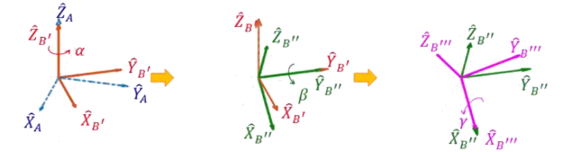

空间中的转动具有3个自由度，一般的转动都是 **按一定的顺序分别绕三个主轴作旋转**，而我们得到的旋转矩阵则是从开始状态相对于结束状态的旋转矩阵，那么好如何把旋转矩阵表达的姿态， **拆解成3次旋转的角度** ， 以得到对应的三个轴的转角？

**拆解需要注意的事项**：

- **Rotation is not commutable** . 转动不可交换，绕轴顺序是固定的。因此要明确旋转的先后顺序。
- 旋转的转轴也要具有明确的定义

**两种拆解方式** ：

- 对 **方向固定不动的转轴** 进行旋转：Fixed Angles
- 对 **转动的frame的转轴** 进行转动：Euler Angles

# 01 Fixed Angles

## 1.1 实施旋转

对于固定转轴的旋转矩阵，我们可以用以下的矩阵来表示：

$$_B^AR_{XYZ}(\gamma, \beta, \alpha) = R_Z(\alpha)R_Y(\beta)R_X(\gamma) = 
\begin{bmatrix}
\cos{\alpha} && -\sin{\alpha} && 0 \\ \sin{\alpha} && \cos{\alpha} && 0 \\ 0 && 0 && 1
\end{bmatrix}
\begin{bmatrix}
\cos{\beta} && 0 && \sin{\beta} \\ 0 && 1 && 0 \\ -\sin{\beta} && 0 && \cos{\beta}
\end{bmatrix}
\begin{bmatrix}
1 && 0 && 0 \\ 0 && \cos{\gamma} && -\sin{\gamma} \\ 0 && \sin{\gamma} && \cos{\gamma}
\end{bmatrix}
$$

因此，如果我们先对X轴转30度，然后对Z轴转60度，最后对Y轴转45度，则其变换为：

$$\hat{p}' =\ _B^AR_{XZY}(\frac{\pi}{6}, \frac{\pi}{3}, \frac{\pi}{4})\hat{p} =\ _B^AR_Y(\frac{\pi}{4})\ _B^AR_Z(\frac{\pi}{3})\ _B^AR_X(\frac{\pi}{6})\hat{p}$$

## 1.2 解算旋转角

为了简化表达，我们将 $\sin{\alpha}$ 记为 $s\alpha$ ，将 $\cos{\alpha}$ 记为 $c\alpha$ 。那么，我们通过 XYZ 顺序得到的旋转矩阵就是

$$_B^AR_{XYZ}(\gamma, \beta, \alpha) = 
\begin{bmatrix}
c\alpha c\beta && c\alpha s\beta s\gamma - s\alpha c\gamma && c\alpha s\beta c\gamma + s\alpha s\gamma \\
s\alpha c\beta && s\alpha s\beta s\gamma + c\alpha c\gamma && s\alpha s\beta c\gamma - c\alpha s\gamma \\
-s\beta && c\beta s\gamma && c\beta c\gamma
\end{bmatrix} = 
\begin{bmatrix}
r_{11} && r_{12} && r_{13} \\
r_{21} && r_{22} && r_{23} \\
r_{31} && r_{32} && r_{33} 
\end{bmatrix}
$$

那么，我们可以知道，如果 $\beta \neq \frac{\pi}{2}$ ，则：

$$\begin{array}{l}
\beta = \arctan{(-r_{31}, \sqrt{r_{11}^2+ r_{21}^2})} \\
\alpha = \arctan{(\dfrac{r_{21}}{c\beta}, \dfrac{r_11}{c\beta})} \\
\gamma = \arctan{(\dfrac{r_32}{c\beta}, \dfrac{r_33}{c\beta})}
\end{array}
$$

如果 $\beta = \frac{\pi}{2}$ ，那么， $\alpha = 0$ , $\gamma = \arctan(r_{12}, r_{22})$ ;

如果 $\beta = -\frac{\pi}{2}$ ，那么， $\alpha = 0$ , $\gamma = -\arctan(r_{12}, r_{22})$ 

# 02 Euler Angles

## 2.1 实施旋转

### 2.1.1 ZYX

对于欧拉角，其转轴是会随着每次的旋转而变化的，因此，我们需要考虑每次旋转之后 body frame 的变化。我们先通过 ZYX 的顺序来看看旋转的变化：

上图可以清晰地看出，每一次旋转之后，其余两个转轴的方向的会发生变化，因此，我们需要找到一个不变的坐标系，来描述这种变化的坐标系。我们假设原本的 body frame 正好与 world frame 重合，那么，每一次转动的物体都会带动 body frame 的变化。在 world frame 下观察，每一次旋转我们都能找到一个由 body frame 向 world frame 变换的旋转矩阵。

假设在 body frame 中有一个向量 $\hat{p}$ ，第一次沿Z轴旋转的时候，我们知道，此时 $\hat{p}$ 在 body frame $\{B\}$  的坐标不变，而在 world frame $\{A1\}$ 中的坐标已经变成了：

$$^{A1}\hat{p} = \begin{bmatrix} \cos\alpha && -\sin\alpha && 0 \\ \sin\alpha && \cos\alpha && 0 \\ 0 && 0 && 1 \end{bmatrix}\ ^B\hat{p}$$

此时，我们以转动过后的 body frame 作为一个新的 world frame $\{A2\}$ ，那么，我们第二次的转动实际上就是：

$$^{A2}\hat{p} = \begin{bmatrix}
\cos{\beta} && 0 && \sin{\beta} \\ 0 && 1 && 0 \\ -\sin{\beta} && 0 && \cos{\beta}
\end{bmatrix}\ ^B\hat{p}$$

我们再令新的 world frame 为现在的 body frame $\{A3\}$ ，那么，最后一次转动就是：

$$^{A3}\hat{p} = \begin{bmatrix}
1 && 0 && 0 \\ 0 && \cos{\gamma} && -\sin{\gamma} \\ 0 && \sin{\gamma} && \cos{\gamma}
\end{bmatrix}\ ^B\hat{p}$$

又因为从 $\{A1\}$ 到 $\{A2\}$ 的坐标变化，从 $\{A2\}$ 到 $\{A3\}$ 的坐标变化的旋转矩阵与对应旋转角一致，那么，最终在 $\{A1\}$ 下的向量 $\hat{p}$ 的坐标可以表示为通过在 $\{A3\}$ 下的坐标一步一步往回推，进行坐标系变化：

1. 在 $\{A3\}$ 下， $\{B\}$ 中向量 $^B\hat{p}$ 的坐标表示为：

$$^{A3}\hat{p} = \begin{bmatrix}
1 && 0 && 0 \\ 0 && \cos{\gamma} && -\sin{\gamma} \\ 0 && \sin{\gamma} && \cos{\gamma}
\end{bmatrix}\ ^B\hat{p}$$

2. 在 $\{A2\}$ 下， $\{A3\}$ 中向量 $^{A3}\hat{p}$ 的坐标表示为：

$$^{A2}\hat{p} = \begin{bmatrix}
\cos{\beta} && 0 && \sin{\beta} \\ 0 && 1 && 0 \\ -\sin{\beta} && 0 && \cos{\beta}
\end{bmatrix}\ ^{A3}\hat{p}$$

3. 在 $\{A1\}$ 下， $\{A2\}$ 中向量 $^{A2}\hat{p}$ 的坐标表示为：

$$^{A1}\hat{p} = \begin{bmatrix} \cos\alpha && -\sin\alpha && 0 \\ \sin\alpha && \cos\alpha && 0 \\ 0 && 0 && 1 \end{bmatrix}\ ^{A2}\hat{p}$$

因此，在 $\{A1\}$ 下，最终转动结束后的向量 $\hat{p}$ 可以表示为：

$$\hat{p} = \begin{bmatrix} \cos\alpha && -\sin\alpha && 0 \\ \sin\alpha && \cos\alpha && 0 \\ 0 && 0 && 1 \end{bmatrix} \begin{bmatrix}
\cos{\beta} && 0 && \sin{\beta} \\ 0 && 1 && 0 \\ -\sin{\beta} && 0 && \cos{\beta}
\end{bmatrix} \begin{bmatrix}
1 && 0 && 0 \\ 0 && \cos{\gamma} && -\sin{\gamma} \\ 0 && \sin{\gamma} && \cos{\gamma}
\end{bmatrix}\ ^B\hat{p}$$

则对应欧拉角的旋转矩阵应该表示为：

$$_B^AR_{Z'Y'X'}(\alpha, \beta, \gamma) = \begin{bmatrix} \cos\alpha && -\sin\alpha && 0 \\ \sin\alpha && \cos\alpha && 0 \\ 0 && 0 && 1 \end{bmatrix} \begin{bmatrix}
\cos{\beta} && 0 && \sin{\beta} \\ 0 && 1 && 0 \\ -\sin{\beta} && 0 && \cos{\beta}
\end{bmatrix} \begin{bmatrix}
1 && 0 && 0 \\ 0 && \cos{\gamma} && -\sin{\gamma} \\ 0 && \sin{\gamma} && \cos{\gamma}
\end{bmatrix} =\ R_Z(\alpha)R_Y(\beta)R_X(\gamma)$$

可以看到，我们所使用的欧拉角的旋转矩阵的**乘积顺序是与固定角相反的**，而且：

$$_B^AR_{Z'Y'X'}(\alpha, \beta, \gamma) = R_Z(\alpha)R_Y(\beta)R_X(\gamma) =\ _B^AR_{XYZ}(\gamma, \beta, \alpha)$$

我们可以找到一个欧拉角和固定角之间的转换方法：**调转乘积顺序，就能从欧拉角旋转矩阵中得到同一姿态变化的固定角的旋转矩阵**。

例如，我们对X‘旋转30度，然后对Z’旋转45度，最后对Y'旋转60度，则我们需要用到的旋转矩阵就是：

$$\hat{p'} =\ _B^AR_{X'Z'Y'}(\frac{\pi}{6}, \frac{\pi}{4}, \frac{\pi}{3}) =\ _B^AR_{X'}(\frac{\pi}{6})\ _B^AR_{Z'}(\frac{\pi}{4})\ _B^AR_{Y'}(\frac{\pi}{3})\hat{p}$$

### 2.1.2 ZYZ

对于ZYZ的旋转顺序，我们得到其旋转矩阵的方法与ZYX的方法类似：

$$_B^AR_{Z'Y'Z'}(\alpha, \beta, \gamma) = R_{Z'}(\alpha)R_{Y'}(\beta)R_{Z'}(\gamma)$$

## 2.2 解算旋转角

我们以 ZYZ 的旋转方式来举例子：

$$_B^AR_{Z'Y'Z'}(\alpha, \beta, \gamma) = 
\begin{bmatrix}
c\alpha c\beta c\gamma - s\alpha s\gamma && -c\alpha c\beta s\gamma - s\alpha c\gamma && c\alpha s\beta \\
s\alpha c\beta c\gamma + c\alpha s\gamma && -s\alpha c\beta s\gamma + c\alpha c\gamma && s\alpha s\beta \\
-s\beta c\gamma && s\beta s\gamma && c\beta
\end{bmatrix} = 
\begin{bmatrix}
r_{11} && r_{12} && r_{13} \\
r_{21} && r_{22} && r_{23} \\
r_{31} && r_{32} && r_{33} 
\end{bmatrix}$$

如果 $\beta \neq 0$ ，那么：

$$\begin{array}{l}
\beta = \arctan{(\sqrt{r_{31}^2 + r_{32}^2}, r_{33})} \\
\alpha = \arctan{(\dfrac{r_{23}}{s\beta}, \dfrac{r_{13}}{s\beta})} \\
\gamma = \arctan{(\dfrac{r_{32}}{s\beta}, -\dfrac{r_{31}}{s\beta})}
\end{array}$$

如果 $\beta = 0$ ，那么 $\alpha = 0$ , $\gamma = \arctan{(-r_{12}, r_{11})}$ ;

如果 $\beta = \pi$ ，那么 $\alpha = 0$ , $\gamma = \arctan{(r_{12}, -r_{11})}$ 

# 03 Summary

对于 Euler/Fixed Angles : 

- 12种 Euler Angles 和 12种 Fixed Angles 转动方式
	- 第一次旋转有3种选择，第二次旋转有2种选择，第三次旋转有2种选择
- 存在转动多元性，我们可以使用不同的转动获得同样的转动姿态

