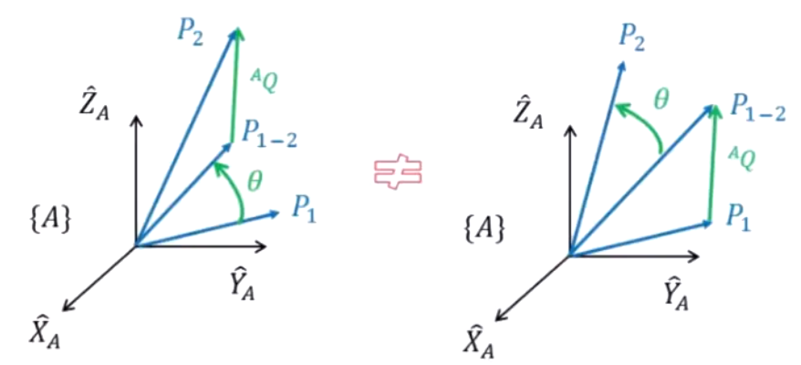

# 01 用法

我们可以通过一个矩阵来表示刚体的移动，也可以通过一个矩阵来表示刚体的转动，那么，可不可以通过 **一个矩阵来同时表示矩阵的移动和旋转** ？

我们把这个矩阵设置为一个分块矩阵：

$$_B^AT = \begin{bmatrix}
 && _B^AR && && ^A\hat{P_B} \\
0 && 0 && 0 && 1
\end{bmatrix} = 
\begin{bmatrix}
| && | && | && | \\
^A\hat{X_B} && ^A\hat{Y_B} && ^A\hat{Z_B} && ^A\hat{P_B} \\
| && | && | && | \\
0 && 0 && 0 && 1
\end{bmatrix}
$$

其中， $_B^AR$ 表示旋转矩阵， $^A\hat{P_B}$ 表示 $\{B\}$ 相对于 $\{A\}$ 的位置。

则应用于一个向量 $^B\hat{P}$ 得到：

$$\begin{bmatrix} ^A\hat{P} \\ 1 \end{bmatrix} = 
\begin{bmatrix}
 && _B^AR && && ^A\hat{P_B} \\
0 && 0 && 0 && 1
\end{bmatrix} \begin{bmatrix} ^B\hat{P} \\ 1 \end{bmatrix} =
\begin{bmatrix} _B^AR\ ^B\hat{P} +\ ^A\hat{P_B} \\ 1 \end{bmatrix}$$

即

$$^A\hat{P} =\ _B^AR\ ^B\hat{P} +\ ^A\hat{P_B}$$

因此，我们可以知道，对于一个向量运用和复合的矩阵之后，其结果的形式表现为： **先转动后移动** 。我们可以看下面这张图：

我们可以很明显地看出，在 **固定角 (fixed angles) 的情况下**，先转动后移动和先移动后转动是不同的，这是因为我们移动是相对于原始的世界坐标系，而转动也是相对于世界坐标系，如果先移动，那么其转动就会导致连带着移动这一部分进行转动，表现为：

$$^A\hat{P'} =\ _B^AR(^B\hat{P} +\ ^A\hat{P_B}) =\ _B^AR\ ^B\hat{P} +\ _B^AR\ ^A\hat{P_B}$$

# 02 总结

对于一个变换矩阵 (Transformation Matrix) ，我们有以下几种用法：

- 描述 **一个坐标系相对于另一个坐标系的状态**
- 描述一个坐标系中的点 **在另一个坐标系中的坐标** 
- 描述一个向量在 **同一坐标系中的变换** 

# 03 计算

## 3.1 连续变换

对于连续变换，实际上就是对同一个目标左乘上多个变换矩阵，因此：

$$\begin{array}{l}
^AP &&=&&\ _B^AT\ ^BP =\ _B^AT(_C^B\ ^CP) =\ _B^AT\ _C^BT\ ^CP \\
&&=&& \begin{bmatrix} && _B^AR && && ^A\hat{P_B} \\ 0 && 0 && 0 && 1 \end{bmatrix} \begin{bmatrix} && _C^BR && && ^B\hat{P_C} \\ 0 && 0 && 0 && 1 \end{bmatrix}\ ^C\hat{P} \\
&&=&& \begin{bmatrix} && _B^AR\ _C^BR && && ^A\hat{P_B} +\ _B^AR\ ^B\hat{P_C} \\ 0 && 0 && 0 && 1 \end{bmatrix}\ ^C\hat{P} \\
&&=&& _C^AT\ ^C\hat{P}
\end{array}$$

## 3.2 逆变换

显然，转动和移动的变换是可逆的，而这一逆变换的过程实际上运用了其逆矩阵， $_A^BT = _B^AT^{-1}$ 。

我们能已知从 $\{B\}$ 到 $\{A\}$ 的变换矩阵，假设从 $\{A\}$ 到 $\{B\}$ 的变换矩阵为：

$$_A^BT = \begin{bmatrix} && _A^BR && && ^B\hat{P_A} \\ 0 && 0 && 0 && 1 \end{bmatrix}$$

则我们可以知道：

$$_B^AT\ _A^BT =\ _B^AT\ _B^AT^{-1} = \begin{bmatrix} && _B^AR && && ^A\hat{P_B} \\ 0 && 0 && 0 && 1 \end{bmatrix} \begin{bmatrix} && _A^BR && && ^B\hat{P_A} \\ 0 && 0 && 0 && 1 \end{bmatrix}$$

因此，

$$\begin{bmatrix} && _B^AR\ _A^BR && && ^A\hat{P_B} +\ _B^AR\ ^B\hat{P_A} \\ 0 && 0 && 0 && 1 \end{bmatrix} = \begin{bmatrix} && && && 0 \\  && I_3 && && 0 \\ && && && 0 \\ 0 && 0 && 0 && 1  \end{bmatrix}$$

于是，我们就可以得到， $_A^BR =\ _B^AR^{-1} =\ _B^AR^T$ , $^B\hat{P_A} = -_B^AR^{-1}\ ^A\hat{P_B} = -_B^AR^T\ ^A\hat{P_B}$ 

