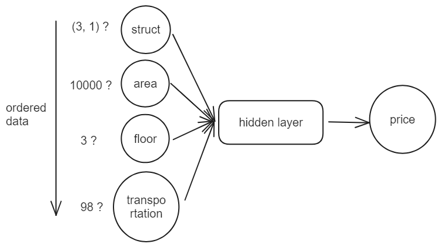
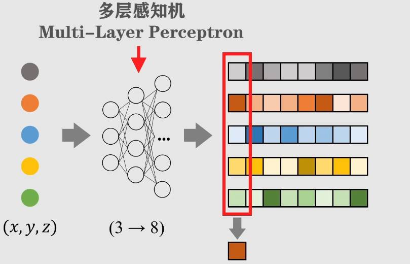
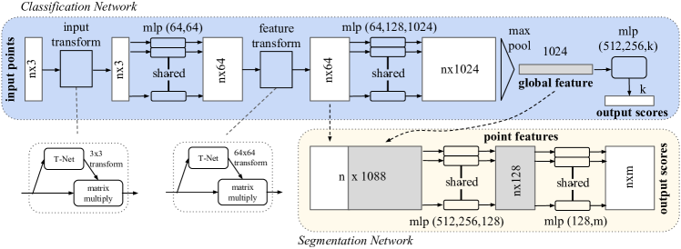
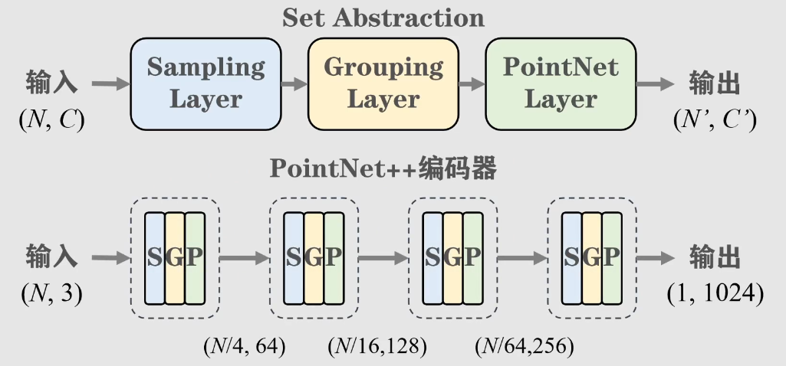

# 00 Introduction

PointNet 和 PointNet++ 是两篇关于通过神经网络处理点云并完成分类、图像分割功能的论文。对于神经网络而言，不管是最普通的全连接网络，还是卷积网络(CNN)，乃至处理序列数据的循环神经网络(RNN)，都对输入的数据有着较高的要求，其中最重要的就是数据的结构和顺序。

对于全连接网络，作为输入的向量 $\vec{x} = (x_1, x_2, \dots, x_n)$ 的每一维度都有着独特的意义。例如，最简单的房价预测，我们可能需要用到房子的占地面积，布局，楼层，地段，装修等信息，这个时候，每一个信息都被编码成一个数据，作为输入向量的一个分量。我们不能打乱各个分量的顺序，否则每个分量对应的实际意义就会发生改变，数据失去了原有的意义，必须严格按照特定的顺序来组成这个输入向量。

对于CNN，输入的是转化为矩阵的图像。对于一张图像而言，数据的顺序就更加重要了，一旦我们打乱了数据的顺序，让每一个像素点重新排列，那么，整张图片就失去了语义，无法被神经网络识别。

而基于序列数据的RNN对数据的顺序有着更大的要求，以机器翻译为例，我们输入的一句话，有着特定的语法规则，不能被随意调换顺序，否则我们都不知道这句话是什么意思，更别说翻译了。

而对于点云数据，其最大的特点就是 **无序** 。我们只需要有一组点，就能根据某一个特定的视角将点排列组成一个物体，就如同拼图。我们拼图需要根据碎片上的信息来猜测碎片的位置，因此我们拼图的过程是有顺序的。但实际上，不管我们先拼哪一块碎片，只要放的位置是正确的，最后组成的图片一定是完成的有意义的图片。点云数据就是如此，点与点之间有着联系，所有的点共同构成一个模型，这个模型呈现出来是有意义的，然而我们如何将点放入到模型中，放入模型的顺序是如何的对整个模型的完成并无任何影响。

这是因为点云数据不同于其他数据，他存储的是某个点的全部信息，最基本的就是位置信息，只要我们有一个点的位置信息，我们就能够将点放在正确的位置上，而不需要考虑点与点之间的关系。可以说，点与点之间的关系在加载数据，输入网络的时候并不重要(不表现出来)，重要的是如何将所有的点都输入到网络中，且保证不同的输入顺序能够有着相同的效果(整体所带来的意义应该是一样的)。如何处理点与点之间似是而非，没用也有用的的关系，是该神经网络的重点。

此外，对于一个扫描成点云的模型，我们将其可视化后，进行旋转、偏移等操作，我们仍能清楚地知道这个模型到底是什么。此时，我们若将坐标转换成旋转过后的视角的坐标系下，输入的点云数据就完全不同，变成了一组新的数据。但实际上，这时同一个物体，一点都没有改变。因此，该网络也需要能够适应刚体运动，排除刚体运动带来的改变。

# 01 Order

用于处理数据顺序的方法有很多种，文中提到了几种方法 : 

1. 将数据排序后传入神经网络
2. 训练一个RNN将数据转换成有序数据
3. 通过一个对称函数(最大池化)来提取这些无序数据的固定特征

1.和2.实现起来十分的麻烦，要使用什么算法来排序，训练的RNN的体积如何确定，如何保证对数据的适应性，以及使用这两种方法所需要的计算资源对整体的负担又如何......

而3.则是一个十分巧妙的方法，能够利用最简单的方法来获取我们所需要的的数据。其主要就是通过对$(N, 3)$ 的数据进行升维，变成 $(N, 64)$ 乃至 $(N, 1024)$ 。其中 $N$ 代表的是输入点的数量，而原本的3就是指 $x, y, z$ 三个分量。在升维之后，我们在垂直方向上对其取最大值，也就是在所有数据的每一个分量上取最大值。对于一组数据，不论数据的顺序如何变化，其最大值都不会改变，因此，这样的方法能很好地提取出整体的特征，将不固定的数据固定下来。

其中，用于升维的 MLP 就是一个待拟合的神经网络通过众多隐藏层提高原始数据的维度(通道数)。

# 02 Alignment

上面曾提到，对于同一物体经过不同刚体变换的点云数据会发生很大的变化，但实际上整体的语义是不变的。因此，需要一种方法处理同一语义的不同输入，并且能够正确地提出出我们需要的特征。

论文中指出，在网络结构中加入一个微型网络 T-net (Transformation net) 用于预测仿射变换的矩阵，经过这个矩阵之后，输入的数据形式在一定程度上被对齐(Align)。在输入数据被处理完之后，我们还需要统一数据蕴含的特征(语义信息)的表现形式。这个也和对输入的处理一样，通过添加一个 T-net 在特征空间上对数据进行转换。

这两个网络的区别在于，前者作用于原始数据，是一个 3x3 的 **旋转矩阵** ，确保网络对输入数据变化的适应性；而后者则作用于经过 MLP 进行特征提取之后的特征空间，是一个维数匹配通道的 **正交矩阵** 。3x3 的旋转矩阵是可逆的，而拟合的 64x64 的矩阵则存在更多的未知性，为了保证变换之后的数据不丢失信息，作者通过在损失中添加一个 **正则化项(Regularization)** 将其约束为一个正交矩阵。这个网络的损失如下 : 

$$L_{reg} = ||I - AA^T||^2_F$$

通过计算与单位矩阵差的 Frobenius 范数的平方来约束该网络接近于一个正交矩阵。

# 03 Enhancement

PointNet++ 相比于 PointNet，最主要的区别在于PointNet++更加关注点云数据的局部结构，注重临近点之间的关系。

PointNet 通过最大池化的操作将所有点云数据集合成单个高维向量，这样做是将所有的点放到同一标准下进行学习与识别。好处在于这种做法十分简单巧妙，对于整体而言识别效果好，速度快，但是，正因为其更多关注整体的信息而容易忽略局部的信息，这样导致在一些小物体，小尺度，或者复杂场景上表现欠佳。而 PointNet++ 则设计了一种分层的网络来提取局部特征。

PointNet++ 的每一层都是多个网络层的集合，由 **采样层(Sampling layer)** 、 **分组层(Grouping layer)** 和 **PointNet 层** 组成。

- Sampling layer - 该层根据给定的点数使用 FPS (最远点采样) 来从给定的点集中提取特征点，称为 **centroids (质心)**
- Grouping layer - 该层在提取了点集的质心的基础上，在每个质心的领域内选定指定数量的点作为一个分组，每一个分组就代表着一个局部结构
- PointNet layer - 读取分组的信息，该层将分组内的各个点与质心之间的关系进行编码，从而在分组的数据中提取局部特征

PointNet++ 由多个这样的抽象层组成，随着网络逐渐深入，每次处理的点数也逐渐减少，而通道数则逐渐增加，提取的特征尺度也越来越大。

这与 CNN 不能说毫无关系，只能说一模一样，浅层的网络能更好的关注到小尺度，局部的信息，而深层的神经网络则能注意到大尺度，整体的信息。改进后的 PointNet++ 在分割任务中有着更好的表现，也更不容易忽略小物体。